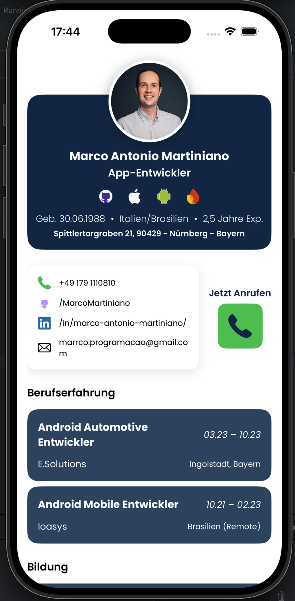
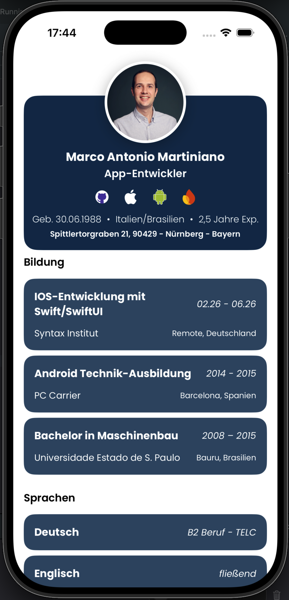

# 📱 CV App – Week 1 Project

An iOS SwiftUI app that presents a digital CV as the first portfolio project in the iOS module.

---

  
  &nbsp;
  

## 🧠 Project Idea

The app displays a modern mobile CV where all important information is shown on a **single screen**:

- Profile & Header
- About Me
- Education
- Work Experience
- Skills
- Contact section

The goal is to learn SwiftUI fundamentals and build a clean, modular app architecture.

---

## 🛠️ Tech Stack

- Swift
- SwiftUI
- Xcode
- MVVM-inspired structure (Models / Views)

---

## 🧱 Project Structure

### Models
- Contact.swift
- Info.swift
- Profile.swift

### Subviews
- CallButtonView.swift
- ContactView.swift
- HeaderView.swift
- ItemListView.swift
- ItemView.swift

### Views
- ContentView.swift

---

## ⚙️ Features

### 📄 CV Display
- Scrollable single-screen CV layout
- All content displayed vertically in sections

### 💼 Data Models
- Work Experience
- Education
- Languages Spoken

### 🧩 Modularization
- UI split into reusable components
- Clean and maintainable code structure

### 📸 Assets
- Profile picture
- Icons (phone, email, address)

### 🔘 Interactions
- Contact button that opens the phone app with my number (Call feature)

---
